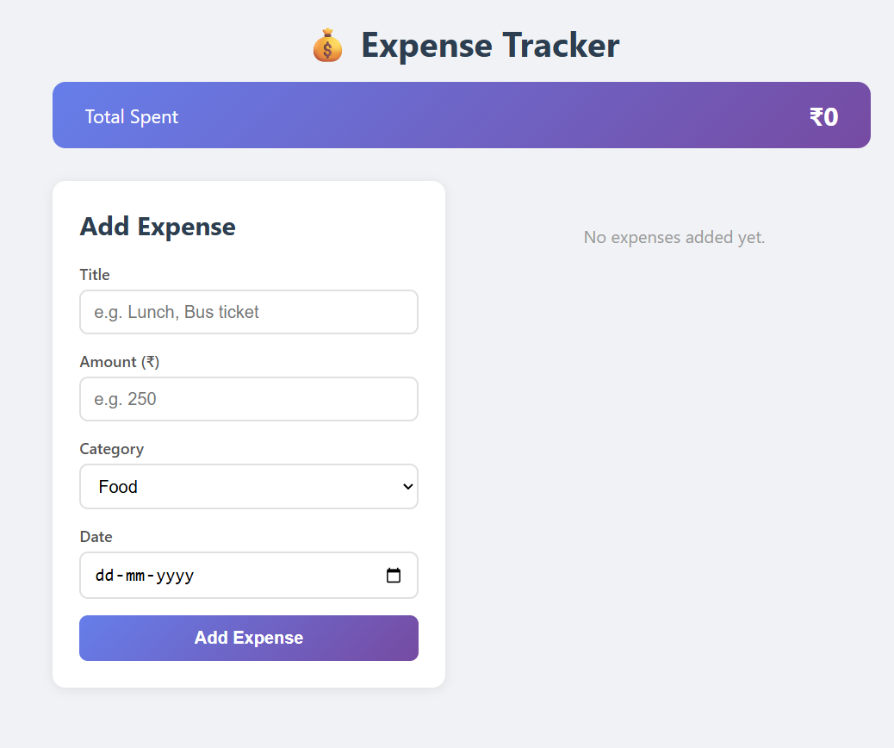
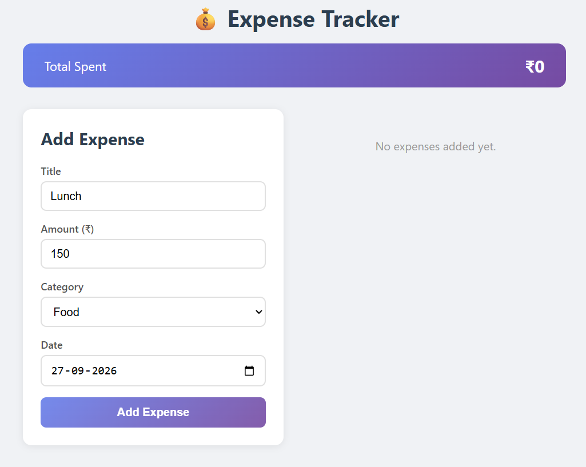
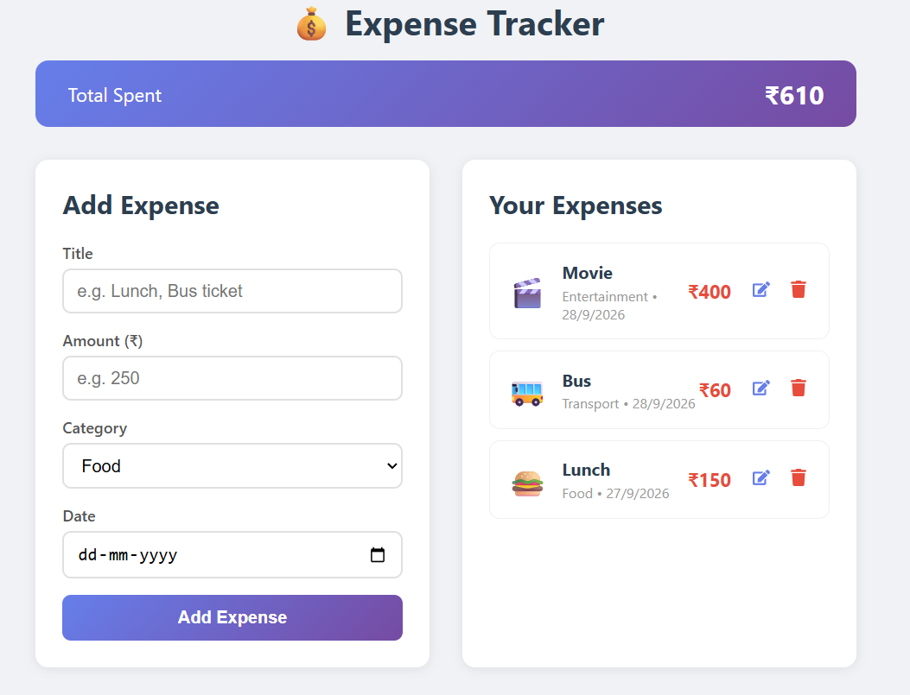
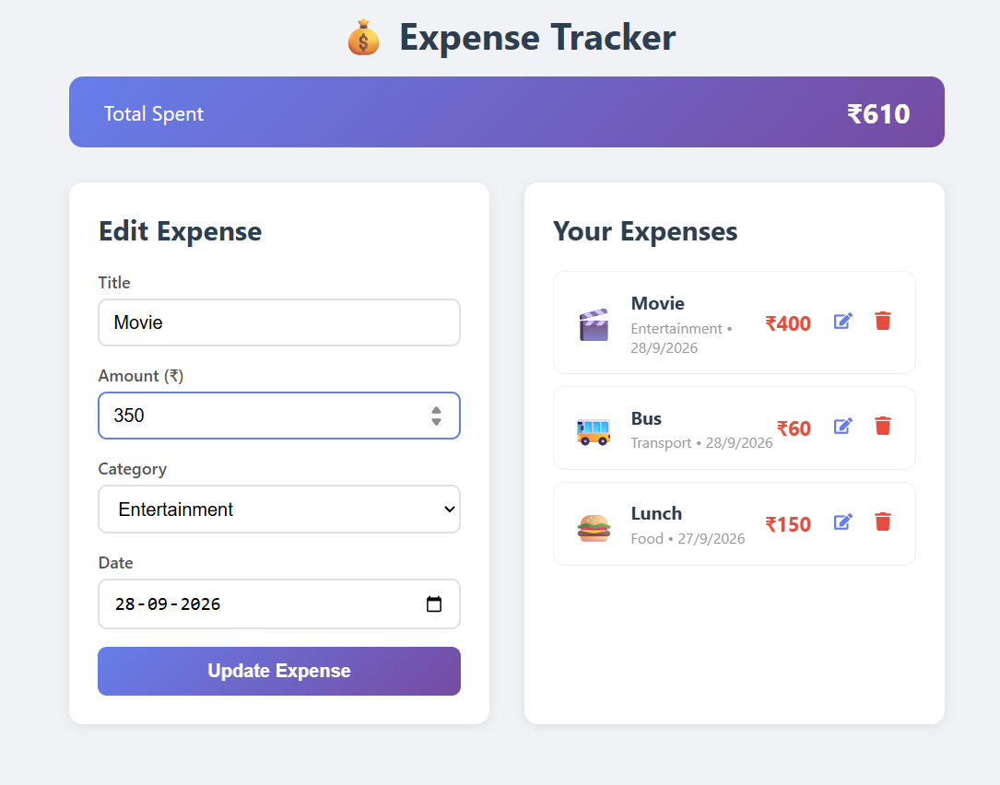
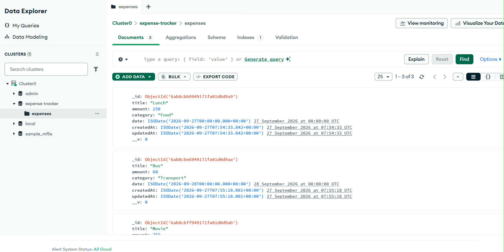
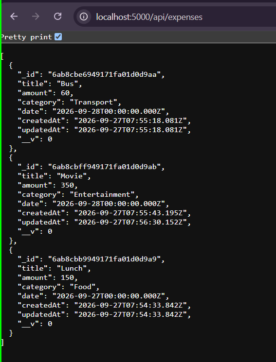

# 💰 Expense Tracker - Full Stack Web Application

## 📌 Project Title
**Expense Tracker** – A Mini Full Stack Web Application developed as part of the Portfolio-Driven Assessment for Full Stack Technologies.

## 🎯 Objective
To build a fully functional web application that demonstrates **Frontend + Backend + Database connectivity** with complete **CRUD (Create, Read, Update, Delete)** operations using modern web technologies.

## 📝 Description
The Expense Tracker is a web application that allows users to manage their daily expenses efficiently. Users can add new expenses with details like title, amount, category, and date. They can view all recorded expenses in a list format, edit existing entries, and delete expenses they no longer need. The application also displays the total amount spent, giving users a quick overview of their spending.

### Key Features:
- **Add Expense** – Users can add new expenses with title, amount, category, and date
- **View Expenses** – All expenses are displayed in a clean, organized list sorted by date
- **Edit Expense** – Users can update any existing expense details
- **Delete Expense** – Users can remove any expense from the list
- **Total Calculation** – Automatically calculates and displays total spending
- **Category-wise Organization** – Expenses are categorized (Food, Transport, Shopping, Bills, Entertainment, Health, Education, Other)
- **Responsive Design** – Works on both desktop and mobile devices

## 🛠️ Tools & Technologies Used

| Technology | Purpose |
|---|---|
| **React.js** | Frontend UI development |
| **HTML/CSS** | Page structure and styling |
| **JavaScript (ES6+)** | Programming language |
| **Node.js** | Backend runtime environment |
| **Express.js** | Backend web framework for REST API |
| **MongoDB Atlas** | Cloud-based NoSQL database |
| **Mongoose** | MongoDB object modeling for Node.js |
| **Axios** | HTTP client for API requests |
| **CORS** | Cross-Origin Resource Sharing middleware |
| **dotenv** | Environment variable management |
| **Git & GitHub** | Version control and repository hosting |
| **VS Code** | Code editor |

## 🏗️ System Architecture

```
┌─────────────────┐       HTTP Requests        ┌─────────────────┐       Mongoose        ┌─────────────────┐
│                 │    (Axios - Port 3000)      │                 │    (Port 5000)        │                 │
│   FRONTEND      │ ──────────────────────────► │   BACKEND       │ ────────────────────► │   DATABASE      │
│   (React.js)    │ ◄────────────────────────── │   (Express.js)  │ ◄──────────────────── │   (MongoDB)     │
│                 │       JSON Responses        │                 │      Documents        │                 │
└─────────────────┘                             └─────────────────┘                       └─────────────────┘
```

### CRUD Operations & API Endpoints:

| Operation | Method | Endpoint | Description |
|---|---|---|---|
| **Create** | POST | `/api/expenses` | Add a new expense |
| **Read** | GET | `/api/expenses` | Fetch all expenses |
| **Update** | PUT | `/api/expenses/:id` | Update an expense by ID |
| **Delete** | DELETE | `/api/expenses/:id` | Delete an expense by ID |

## 📁 Project Structure

```
expense-tracker/
├── backend/
│   ├── config/
│   │   └── db.js                # MongoDB connection configuration
│   ├── models/
│   │   └── Expense.js           # Mongoose schema for expenses
│   ├── routes/
│   │   └── expenseRoutes.js     # Express API routes (CRUD)
│   ├── .env                     # Environment variables (not pushed to GitHub)
│   ├── server.js                # Express server entry point
│   ├── package.json             # Backend dependencies
│   └── package-lock.json
├── frontend/
│   ├── public/
│   ├── src/
│   │   ├── components/
│   │   │   ├── ExpenseForm.js   # Form component for add/edit
│   │   │   ├── ExpenseList.js   # List component to display expenses
│   │   │   └── ExpenseItem.js   # Individual expense card component
│   │   ├── App.js               # Main application component
│   │   ├── App.css              # Application styles
│   │   ├── index.js             # React entry point
│   │   └── index.css            # Global styles
│   ├── package.json             # Frontend dependencies
│   └── package-lock.json
├── .gitignore
└── README.md
```

## ⚙️ How to Run the Project

### Prerequisites
- Node.js (v14 or above) installed
- MongoDB Atlas account (free tier)
- Git installed

### Step 1: Clone the Repository
```bash
git clone https://github.com/Haripriya1234566/expense-tracker.git
cd expense-tracker
```

### Step 2: Setup Backend
```bash
cd backend
npm install
```

Create a `.env` file inside the `backend` folder:
```
PORT=5000
MONGO_URI=your_mongodb_atlas_connection_string
```

Start the backend server:
```bash
npm run dev
```

You should see:
```
Server running on port 5000
MongoDB Connected: ...
```

### Step 3: Setup Frontend
Open a new terminal:
```bash
cd frontend
npm install
npm start
```

The app will open at `http://localhost:3000`

### Step 4: Use the Application
- Fill in the expense details (Title, Amount, Category, Date)
- Click **"Add Expense"** to create a new entry
- Click the ✏️ icon to edit an expense
- Click the 🗑️ icon to delete an expense
- View the total spending at the top

## 📸 Output Screenshots

### 1. Home Page - Empty State


### 2. Adding a New Expense


### 3. Expense List with Multiple Entries


### 4. Editing an Expense


### 5. MongoDB Atlas - Data Stored in Database


### 6. Backend API Response


## 👩‍💻 Developed By
- **Name:** Haripriya
- **Project:** Portfolio-Driven Assessment – Full Stack Technologies
- **GitHub:** [https://github.com/Haripriya1234566/expense-tracker](https://github.com/Haripriya1234566/expense-tracker)

## 📄 License
This project is developed for academic purposes as part of the Full Stack Technologies course.